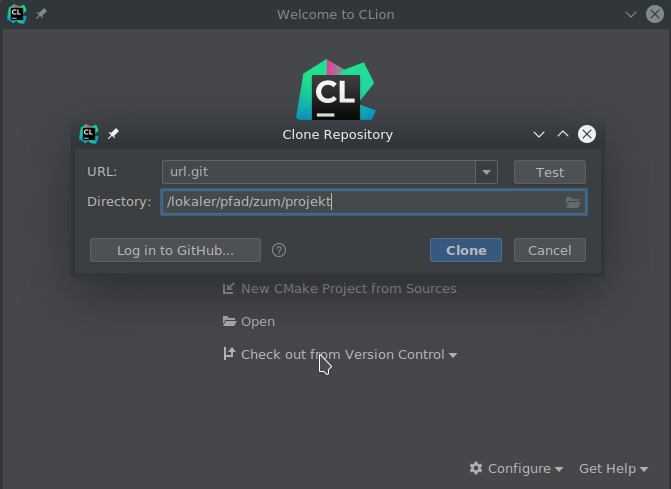
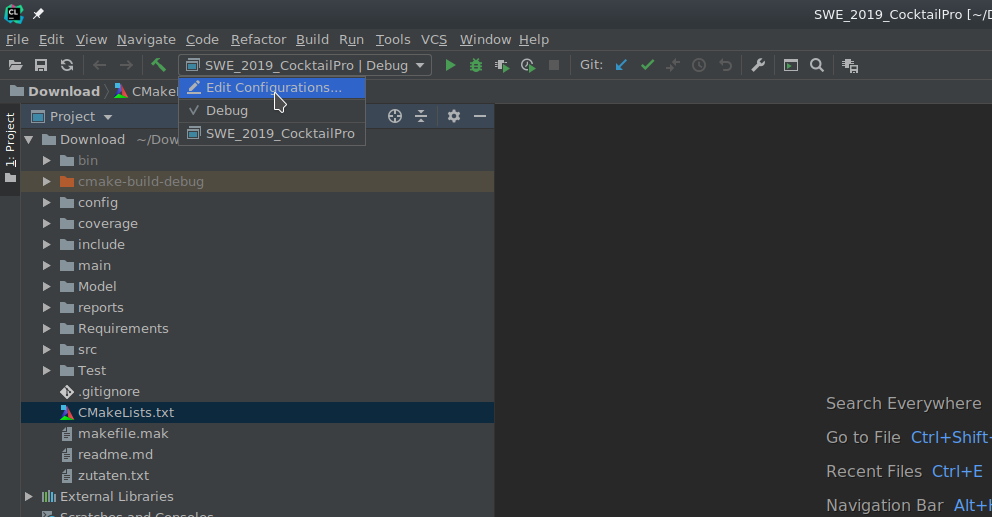
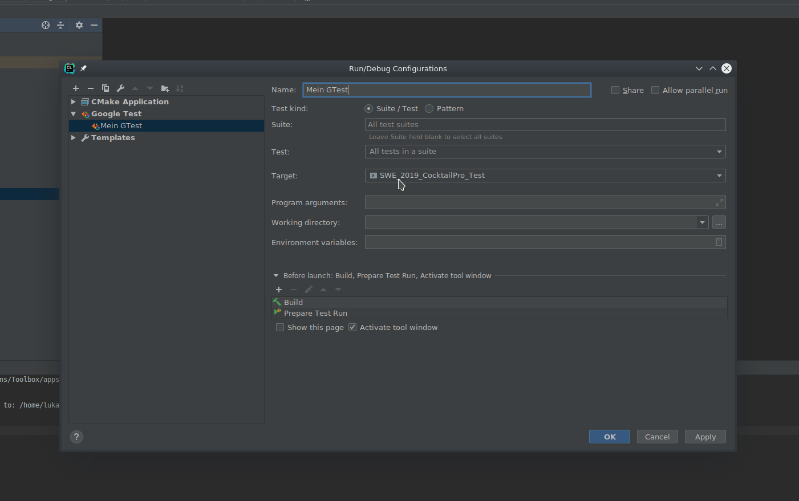

# CocktailPro Legacy

Im Jahr 2015 wurde eine Software zur Simulation eines Cocktail-Misch-Geräts entwickelt: der "CocktailPro". Die Software wurde aber nicht für einen dauerhaften Betrieb entwickelt. Deshalb enthält der Code praktisch keine Kommentare und leider auch keine andere Dokumentation. Auch kleinere Fehler sind bekannt, wurden aber nie korrigiert.
Nun soll die Software von Ihnen weiterentwickelt werden, allerdings so, dass die üblichen Qualitätsansprüche an eine "ernst gemeinte" Software erfüllt sind. 
Sie erhalten den vollständigen und kompilierbaren Code des CocktailPro's. 
Ihre Aufgabe im gesamten Praktikum besteht darin, das System wartbarer zu machen und um neue Funktionen zu erweitern.

## Legen Sie los!

Um das Projekt weiterentwickeln und Tests erstellen zu können, müssen Sie das Projektverzeichnis auf Ihren lokalen Rechner "clonen". Falls die erforderliche Software bereits installiert ist, können Sie mit folgenden Befehlen den Code und die Tests erstellen.
-make build
-make build-tests

Wenn der Build erfolgreich verlaufen ist, finden Sie im Ordner "bin" die ausführbaren Konsolenanwendungen "CocktailPro.exe" und "CocktailProTest.exe".

### Voraussetzungen

In diesem Projekt verwenden wir Jenkins als Continuous Integration Server.
Innerhalb des Hochschulnetzwerks können Sie den Jenkins-Server einfach aufrufen. Von außerhalb der Hochschule müssen Sie eine VPN-Verbindung verwenden. Jenkins lädt Ihre Quellcode-Dateien automatisch aus Ihrem Git-Repository.
Die Entwicklung des Codes erfolgt unter Verwendung von Git.

Um die Software weiterentwickeln zu können, brauchen Sie entsprechende Software. Auf den Laborrechnern ist diese vorhanden, auf Ihrem Privatrechner müssen Sie die Software eventuell noch installieren

- **Git** (https://git-scm.com) und

- evtl. ein **grafischer Git-Client** (z.B. https://tortoisegit.org/)

- **VPN-Software** (z.B. https://github.com/openconnect/openconnect-gui/releases)
Als Gateway müssen Sie https://firewall.fbi.h-da.de eintragen, als Protokoll Cisco Anyconnect und als Usernamen Ihren ist-Account

- **Gnu-Compiler g++**, **make**, **gdb** und **cmake** (Für Windows Cygwin: https://www.cygwin.com/)

- **JetBrains CLion** (https://www.jetbrains.com/clion/ - Anmerkungen zur Lizenz allgemeine Anmerkungen zum Praktikum)

## Entwicklung in CLion

Öffnen Sie CLion, geben Sie bei erstmaligem öffnen Ihre Nutzerdaten ein und klicken sich durch den Wizard. Klicken Sie anschließend auf **Check out from Version Control** ung **git** um ein Projekt von git zu clonen. Geben Sie dort die URL zum git Repository und den Speicherort des Projekts an (siehe Screenshot). Anschließend öffnen Sie das Projekt (Sie werden nach auschecken gefragt, ob das Projekt geöffnet werden soll).

### Starten der GTests

Für eine grafische Auswertung der GTests in CLion, müssen Sie eine **GTest Configuration** anlegen. Klicken Sie hierzu oben auf die Configurations und wähen **Edit Configurations** aus (siehe Screenshot).

Anschließend klicken Sie oben rechts auf das **+**, wählen **Google Test** aus und stellen bei **Target** auf **SWE_2019_CocktailPro_Test** (siehe Screenshot).

## Viel Erfolg mit dem CocktailPro!

Ralf Hahn

Stefan T. Ruehl
